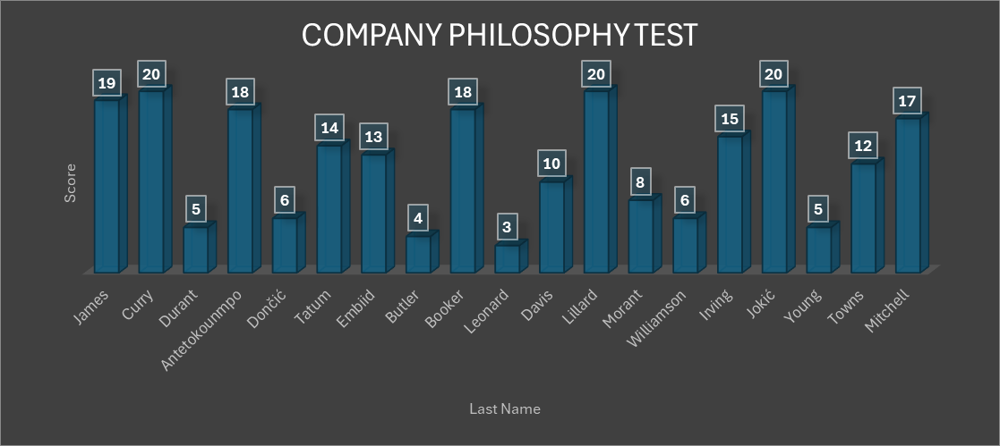

# 📊 Excel Projects

## 📌 Purpose

To showcase proficiency in Microsoft Excel through practical, real-world projects. Each project demonstrates use of formulas, functions, formatting, data analysis, and visualization where applicable.

---

## 🧾 Project 1: Payroll Calculator

### 🎯 Description

This project simulates a monthly payroll for employees, including calculations for regular and overtime pay. The goal was to practice and demonstrate:

* Use of **basic arithmetic formulas**
* Application of the **IF function** to calculate overtime pay
* Use of **absolute vs relative cell references**
* Aggregating data using **SUM**, **AVERAGE**, **MAX**, and **MIN**
* Professional **spreadsheet formatting** for clarity

### 📁 Excel Features Used

* **Formulas:**

  * `=IF(condition, value_if_true, value_if_false)`
  * `=SUM(range)`, `=AVERAGE(range)`, `=MAX(range)`, `=MIN(range)`
* **Cell Referencing:**

  * Absolute (`$A$1`)
  * Relative (`A1`)
* **Basic Styling:**

  * Currency formatting
  * Conditional formatting (optional highlight: overtime hours, totals, etc.)
  * Borders and alignment for readability

### 🧮 Dataset Overview

* 20 Employees
* 5 weeks of regular and overtime hours
* Hourly wage used to calculate:

  * Base pay
  * Overtime pay (usually time-and-a-half)
  * Total pay per week
  * Total monthly earnings

### 📊 Sample Metrics

| Metric                | Value      |
| --------------------- | ---------- |
| Average Hourly Wage   | £17.75     |
| Total January Payroll | £70,251.68 |
| Max Total Pay         | £4,540.00  |
| Min Total Pay         | £2,709.00  |


## 📝 Project 2: Gradebook Assessment Tracker

### 🎯 Description

This gradebook simulates employee or student evaluation based on multiple tests. It calculates scores, percentages, and automatically flags underperformance using logical functions. It also visualizes performance across key categories using charts.

---

### 📁 Excel Features Used

* ✅ **Conditional Formatting**

  * Highlights low scores automatically
  * Makes failures visually stand out

* ✅ **Logical Functions**

  * `OR()` and `IF()` used to trigger a “Fire Employee” flag
  * Example logic:

    ```excel
    =OR(Safety%<60%, Philosophy%<60%, Financial%<60%, DrugTest<>1)
    ```

* ✅ **Data Transformation**

  * Raw scores converted to percentages for clear comparison

* ✅ **Summary Metrics**

  * `MAX`, `MIN`, and `AVERAGE` calculated for each test

* ✅ **Data Visualization**

  * Column charts created for each test category:

    * **Company Philosophy Test**
    * **Safety Test**
    * **Financial Skills Test**

---

### 📊 Performance Charts

#### 📘 Company Philosophy Test



#### 🚧 Safety Test

](Graphs/safety_test.png)

#### 💰 Financial Skills Test

](Graphs/financial.png)

---

### 🧠 Logic for Termination Flag

An employee is marked `TRUE` in the **"Fire Employee"** column if **any** of the following conditions are met:

* Safety Test score < 50%
* Company Philosophy Test score < 50%
* Financial Skills Test score < 50%
* Drug Test score ≠ 1 (failed)

This helps demonstrate real-world logical decision-making automation using Excel functions.

---

### 📌 Key Stats

| Metric                 | Safety Test | Company Philosophy | Financial Skills | Drug Test |
| ---------------------- | ----------- | ------------------ | ---------------- | --------- |
| **Max Score**          | 10          | 20                 | 100              | 1         |
| **Min Score**          | 1           | 3                  | 10               | 0         |
| **Average Score**      | 6.00        | 12.26              | 60.84            | 0.74      |
| **Average Percentage** | 60%         | 61%                | 61%              | 74%       |

